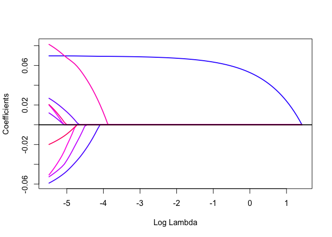
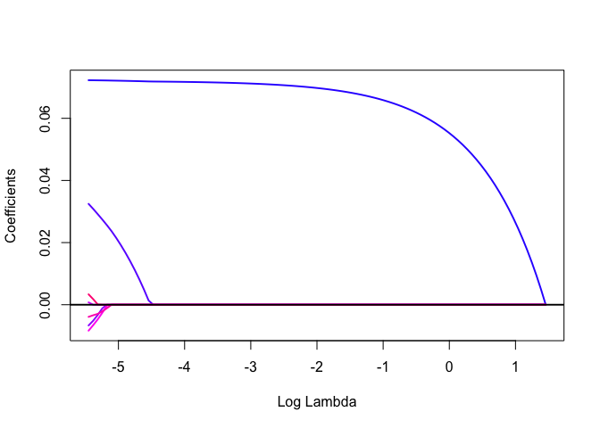

LPA\_trial
================
Bowen Liu
9/30/22

## PSS

A more reasonable way is to include 1738 persons that completes the PSS-10 survey. Then claim that 1699 of them complete "all" the corresponding demographic questions. (Which, we avoid the imputation at this stage. (39/1738 did not enter all the responses))

``` r
setwd("~/Desktop/covid19_survey")
covid = read.csv("covid19_data.csv")
sum(is.na(covid$Q1)) 
```

    ## [1] 2

``` r
# There are 2 null responses for Q1, which indicates these 2 "participants" did 
# not click on anaything to the informed consent form at the beginning. Hence, it's reasonabale to exclude them as part of this study. 
covid = covid[-c(which(is.na(covid$Q1)==TRUE)),] 
dim(covid) #Check if the null responses have been removed. 
```

    ## [1] 2088   67

``` r
sum(covid$Q1 == 6) 
```

    ## [1] 5

``` r
#6 indicates that these "participants"" answered no for the informed consent form, 
#Thus, we have 5 people did not agree with the information consent form. They
#should be excluded from the participants of this study. 
covid = covid[-c(which(covid$Q1 == 6)),] 
#dim(covid) #Now this should leave us with 83 responses in total from the start
#### Demographics continues here
covid_pss = covid[-c(which(is.na(covid$PSS_1)==TRUE|is.na(covid$PSS_2)==TRUE|is.na(covid$PSS_3)==TRUE|
is.na(covid$PSS_4)==TRUE|is.na(covid$PSS_5)==TRUE|is.na(covid$PSS_6)==TRUE|is.na(covid$PSS_7)==TRUE|is.na(covid$PSS_8)==TRUE|is.na(covid$PSS_9)==TRUE|is.na(covid$PSS_10)==TRUE)),]
 #345 responses was deleted here. 1738 responses left for CAS scale calculation
##### We shall only include complete responses for a scale. 
##### Adding a column for total score of PSS, notice in the qualtrics the responses were labelled as 1-5.
##### Instead the actual range for each response is 0-4. 
##### 1,2,3,6,9,10 are negative questions, so sum them first and -6 for the reasons stated above. 
##### For 4,5,7,8, the original range in the dataset is 1-5. Now we reverse it by using 5 minus the item. 
covid_pss_scale = covid_pss[,c(19:28)]
library(psych)
KMO(covid_pss_scale)
```

    ## Kaiser-Meyer-Olkin factor adequacy
    ## Call: KMO(r = covid_pss_scale)
    ## Overall MSA =  0.9
    ## MSA for each item = 
    ##  PSS_1  PSS_2  PSS_3  PSS_4  PSS_5  PSS_6  PSS_7  PSS_8  PSS_9 PSS_10 
    ##   0.90   0.91   0.93   0.87   0.86   0.91   0.88   0.88   0.93   0.90

``` r
bartlett.test(covid_pss_scale)
```

    ## 
    ##  Bartlett test of homogeneity of variances
    ## 
    ## data:  covid_pss_scale
    ## Bartlett's K-squared = 296.63, df = 9, p-value < 2.2e-16

``` r
attach(covid_pss)
covid_pss$PSS_total = (PSS_1+PSS_2+PSS_3+ PSS_6+PSS_9+PSS_10 -6)+(5-PSS_4)+(5-PSS_5)+(5-PSS_7)+(5-PSS_8) 
detach(covid_pss)

#### FA
covid_pss_scale = covid_pss
covid_pss_scale$PSS_1 = covid_pss_scale$PSS_1-1
covid_pss_scale$PSS_2 = covid_pss_scale$PSS_2-1
covid_pss_scale$PSS_3 = covid_pss_scale$PSS_3-1
covid_pss_scale$PSS_6 = covid_pss_scale$PSS_6-1
covid_pss_scale$PSS_9 = covid_pss_scale$PSS_9-1
covid_pss_scale$PSS_10 = covid_pss_scale$PSS_10-1
covid_pss_scale$PSS_4 = 5-covid_pss_scale$PSS_4
covid_pss_scale$PSS_5 = 5-covid_pss_scale$PSS_5
covid_pss_scale$PSS_7 = 5-covid_pss_scale$PSS_7
covid_pss_scale$PSS_8 = 5-covid_pss_scale$PSS_8
covid_pss_scale$total = covid_pss$PSS_total
#covid_pss_men = subset(covid_pss_scale,Q1.1 == 1)
#covid_pss_women = subset(covid_pss_scale,Q1.1 == 2)
covid_pss_scale = covid_pss_scale[,c(19:28)]
#covid_pss_scale_women = covid_pss_women[,c(19:28)]
#covid_pss_scale_men = covid_pss_men[,c(19:28)]
library(MASS)
library(psych)
library(REdaS)
```

    ## Loading required package: grid

``` r
KMO(covid_pss_scale)
```

    ## Kaiser-Meyer-Olkin factor adequacy
    ## Call: KMO(r = covid_pss_scale)
    ## Overall MSA =  0.9
    ## MSA for each item = 
    ##  PSS_1  PSS_2  PSS_3  PSS_4  PSS_5  PSS_6  PSS_7  PSS_8  PSS_9 PSS_10 
    ##   0.90   0.91   0.93   0.87   0.86   0.91   0.88   0.88   0.93   0.90

``` r
#Diagnol of the anti-image correlation matrix
diag(KMO(covid_pss_scale)$ImCov)
```

    ##  [1] 0.4548317 0.4086692 0.4532787 0.6328748 0.5672868 0.4738059 0.6337709
    ##  [8] 0.5069843 0.5665943 0.3801043

``` r
###Only 4,5,7,8,9 are included.(Since the corresponding diagonal elements of the anti-image correlation matridx > 0.5)
covid_pss_scale = covid_pss_scale[,c(4,5,7,8,9)]
#bartlett.test(covid_pss_scale)
bart_spher(covid_pss_scale)
```

    ##  Bartlett's Test of Sphericity
    ## 
    ## Call: bart_spher(x = covid_pss_scale)
    ## 
    ##      X2 = 2215.764
    ##      df = 10
    ## p-value < 2.22e-16

``` r
KMO(covid_pss_scale)
```

    ## Kaiser-Meyer-Olkin factor adequacy
    ## Call: KMO(r = covid_pss_scale)
    ## Overall MSA =  0.81
    ## MSA for each item = 
    ## PSS_4 PSS_5 PSS_7 PSS_8 PSS_9 
    ##  0.81  0.79  0.83  0.80  0.87

``` r
pca_pss = princomp(covid_pss_scale, scores=TRUE, cor=TRUE)
screeplot(pca_pss, type="line", main="Scree Plot") 
```


``` r
summary(pca_pss)
```

    ## Importance of components:
    ##                           Comp.1    Comp.2    Comp.3    Comp.4     Comp.5
    ## Standard deviation     1.6235982 0.9353223 0.7349802 0.7149809 0.66159471
    ## Proportion of Variance 0.5272142 0.1749656 0.1080392 0.1022395 0.08754151
    ## Cumulative Proportion  0.5272142 0.7021798 0.8102189 0.9124585 1.00000000

``` r
library(nFactors)
```

    ## Loading required package: lattice

    ## 
    ## Attaching package: 'nFactors'

    ## The following object is masked from 'package:lattice':
    ## 
    ##     parallel

``` r
fa.parallel(covid_pss_scale)
```


    ## Parallel analysis suggests that the number of factors =  2  and the number of components =  1

``` r
a = factanal(covid_pss_scale,factor=2,rotation = "varimax",scores = "regression")
communality = 100*(1 - a$uniquenesses) 
fa.pss <- fa(r=covid_pss_scale, 
 nfactors = 2, SMC=TRUE, covar=TRUE,
 fm="pa", # type of factor analysis we want to use (“pa” is principal axis factoring)
 max.iter=50, # (50 is the default, but we have changed it to 100
 rotate="varimax") # none rotation
print(fa.pss)
```

    ## Factor Analysis using method =  pa
    ## Call: fa(r = covid_pss_scale, nfactors = 2, rotate = "varimax", SMC = TRUE, 
    ##     covar = TRUE, max.iter = 50, fm = "pa")
    ## Unstandardized loadings (pattern matrix) based upon covariance matrix
    ##        PA1  PA2   h2   u2   H2   U2
    ## PSS_4 0.73 0.20 0.57 0.44 0.56 0.44
    ## PSS_5 0.57 0.42 0.50 0.40 0.55 0.45
    ## PSS_7 0.49 0.41 0.41 0.50 0.45 0.55
    ## PSS_8 0.55 0.52 0.58 0.50 0.54 0.46
    ## PSS_9 0.15 0.47 0.24 1.12 0.18 0.82
    ## 
    ##                        PA1  PA2
    ## SS loadings           1.42 0.88
    ## Proportion Var        0.27 0.17
    ## Cumulative Var        0.27 0.44
    ## Proportion Explained  0.62 0.38
    ## Cumulative Proportion 0.62 1.00
    ## 
    ##  Standardized loadings (pattern matrix)
    ##       item  PA1  PA2   h2   u2
    ## PSS_4    1 0.72 0.20 0.56 0.44
    ## PSS_5    2 0.60 0.44 0.55 0.45
    ## PSS_7    3 0.51 0.43 0.45 0.55
    ## PSS_8    4 0.53 0.50 0.54 0.46
    ## PSS_9    5 0.13 0.40 0.18 0.82
    ## 
    ##                  PA1  PA2
    ## SS loadings     1.45 0.84
    ## Proportion Var  0.29 0.17
    ## Cumulative Var  0.29 0.46
    ## Cum. factor Var 0.63 1.00
    ## 
    ## Mean item complexity =  1.6
    ## Test of the hypothesis that 2 factors are sufficient.
    ## 
    ## The degrees of freedom for the null model are  10  and the objective function was  1.34 with Chi Square of  2328.89
    ## The degrees of freedom for the model are 1  and the objective function was  0 
    ## 
    ## The root mean square of the residuals (RMSR) is  0.01 
    ## The df corrected root mean square of the residuals is  0.02 
    ## 
    ## The harmonic number of observations is  1738 with the empirical chi square  2.06  with prob <  0.15 
    ## The total number of observations was  1738  with Likelihood Chi Square =  4.33  with prob <  0.037 
    ## 
    ## Tucker Lewis Index of factoring reliability =  0.986
    ## RMSEA index =  0.044  and the 90 % confidence intervals are  0.009 0.089
    ## BIC =  -3.13
    ## Fit based upon off diagonal values = 1
    ## Measures of factor score adequacy             
    ##                                                    PA1   PA2
    ## Correlation of (regression) scores with factors   0.79  0.63
    ## Multiple R square of scores with factors          0.62  0.40
    ## Minimum correlation of possible factor scores     0.24 -0.20

``` r
fa.diagram(fa.pss)
```


``` r
factor1 = fa.pss$scores[,1]
factor2 = fa.pss$scores[,2]
IQR(factor1)
```

    ## [1] 0.9697959

``` r
length(which(factor1<quantile(factor1,0.75)+1.5*IQR(factor1) & factor1>quantile(factor1,0.25)-1.5*IQR(factor1)))
```

    ## [1] 1711

``` r
include_factor = which(factor1<quantile(factor1,0.75)+1.5*IQR(factor1) & factor1>quantile(factor1,0.25)-1.5*IQR(factor1))

#length(which(factor2<quantile(factor2,0.75)+1.5*IQR(factor2) & factor1>quantile(factor2,0.25)-1.5*IQR(factor2)))

sex = covid_pss$Q1.1
race = covid_pss$Q4
fin = covid_pss$Q24
class = covid_pss$Q6
age = covid_pss$Q5
employ = covid_pss$Q11
marital = covid_pss$Q3
total = covid_pss$PSS_total
# We want to set the base levels correspondingly
# sex: transgender as 0
sex[sex==3] = 0
#race: other as 0
race[race==9] = 0
#fin: no change as 0
fin[fin==3] = 0
#class: other as 0
class[class==9] = 0
#age: 75 or older as 0
## age 3,4,5,6,7 combine
## There is a signficant change since the base level changed in this analysis
age[age==3] = 0
age[age==4] = 0
age[age==5] = 0
age[age==6] = 0
age[age==7] = 0
# This is expected to be 57 responses from the "45 or over group". 
# The univariate analysis needs to be done again
# The base level listed in the manuscript is incorrect, but this can be explained since we 'redo the analysis'
# check the stepwise regression part.

#employ: other as 0 
employ[employ==7] = 0
#marital: other as 0
marital[marital==7] = 0
#child = covid_pss$Q15
factor_score_anal = data.frame(class = as.factor(class),
                               sex = as.factor(sex),
                               race = as.factor(race),
                               fin = as.factor(fin),
                               age = as.factor(age),
                               employ = as.factor(employ),
                               marital = as.factor(marital),
                               #child = as.factor(child),
                               factor1 = factor1,
                               factor2 = factor2,
                               total = total
                               
                          )

factor_score_anal = na.omit(factor_score_anal) #1699 left
#univariate
tapply(factor_score_anal$total,factor_score_anal$class,mean)
```

    ##        0        1        2        3        4        5        6        7 
    ## 20.75000 20.64211 22.45185 22.88013 22.27839 22.51266 19.55747 19.47368 
    ##        8 
    ## 19.37500

``` r
tapply(factor_score_anal$total,factor_score_anal$sex,mean)
```

    ##        0        1        2 
    ## 27.43750 19.71845 22.18750

``` r
tapply(factor_score_anal$total,factor_score_anal$race,mean)
```

    ##        0        1        2        3        4        5        6        7 
    ## 19.61905 21.75000 21.13490 20.25000 22.23821 22.28000 21.25000 21.47846 
    ##        8 
    ## 21.93043

``` r
tapply(factor_score_anal$total,factor_score_anal$fin,mean)
```

    ##        0        1        2        4        5 
    ## 17.94133 24.67412 20.95507 20.22449 17.06452

``` r
tapply(factor_score_anal$total,factor_score_anal$age,mean)#notice '0' stands for '45 and over'
```

    ##        0        1        2 
    ## 18.81921 22.19201 20.80593

``` r
tapply(factor_score_anal$total,factor_score_anal$employ,mean)
```

    ##        0        1        2        3        4        5        6 
    ## 20.32836 20.79747 21.72773 21.08462 23.91573 16.60000 26.46154

``` r
tapply(factor_score_anal$total,factor_score_anal$marital,mean)
```

    ##        0        1        2        3        4        5        6 
    ## 20.52941 19.01951 22.33333 20.59259 26.41667 22.74641 21.73817

``` r
# ANOVA: H_0: The mean score is the same for all the group
summary(aov(total~class,data = factor_score_anal)) 
```

    ##               Df Sum Sq Mean Sq F value   Pr(>F)    
    ## class          8   2870   358.7   6.164 7.28e-08 ***
    ## Residuals   1690  98339    58.2                     
    ## ---
    ## Signif. codes:  0 '***' 0.001 '**' 0.01 '*' 0.05 '.' 0.1 ' ' 1

``` r
summary(aov(total~sex,data = factor_score_anal))
```

    ##               Df Sum Sq Mean Sq F value   Pr(>F)    
    ## sex            2   3305  1652.4   28.62 5.94e-13 ***
    ## Residuals   1696  97904    57.7                     
    ## ---
    ## Signif. codes:  0 '***' 0.001 '**' 0.01 '*' 0.05 '.' 0.1 ' ' 1

``` r
summary(aov(total~race,data = factor_score_anal)) 
```

    ##               Df Sum Sq Mean Sq F value Pr(>F)
    ## race           8    527   65.84   1.105  0.356
    ## Residuals   1690 100682   59.57

``` r
summary(aov(total~fin,data = factor_score_anal)) 
```

    ##               Df Sum Sq Mean Sq F value Pr(>F)    
    ## fin            4  12137  3034.2   57.71 <2e-16 ***
    ## Residuals   1694  89071    52.6                   
    ## ---
    ## Signif. codes:  0 '***' 0.001 '**' 0.01 '*' 0.05 '.' 0.1 ' ' 1

``` r
summary(aov(total~age,data = factor_score_anal))
```

    ##               Df Sum Sq Mean Sq F value   Pr(>F)    
    ## age            2   1999   999.7   17.09 4.48e-08 ***
    ## Residuals   1696  99209    58.5                     
    ## ---
    ## Signif. codes:  0 '***' 0.001 '**' 0.01 '*' 0.05 '.' 0.1 ' ' 1

``` r
summary(aov(total~employ,data = factor_score_anal))
```

    ##               Df Sum Sq Mean Sq F value   Pr(>F)    
    ## employ         6   1965   327.5   5.583 9.54e-06 ***
    ## Residuals   1692  99243    58.7                     
    ## ---
    ## Signif. codes:  0 '***' 0.001 '**' 0.01 '*' 0.05 '.' 0.1 ' ' 1

``` r
summary(aov(total~marital,data = factor_score_anal))
```

    ##               Df Sum Sq Mean Sq F value   Pr(>F)    
    ## marital        6   1984   330.6   5.637 8.29e-06 ***
    ## Residuals   1692  99225    58.6                     
    ## ---
    ## Signif. codes:  0 '***' 0.001 '**' 0.01 '*' 0.05 '.' 0.1 ' ' 1

``` r
# Kruskal-Wallis: H_0: The rank of the groups are the same (Given the shape similarity conditions, this is equivalent to test all the groups have the same median)
kruskal.test(total~class,data = factor_score_anal) 
```

    ## 
    ##  Kruskal-Wallis rank sum test
    ## 
    ## data:  total by class
    ## Kruskal-Wallis chi-squared = 46.996, df = 8, p-value = 1.536e-07

``` r
kruskal.test(total~sex,data = factor_score_anal)
```

    ## 
    ##  Kruskal-Wallis rank sum test
    ## 
    ## data:  total by sex
    ## Kruskal-Wallis chi-squared = 60.448, df = 2, p-value = 7.479e-14

``` r
kruskal.test(total~race,data = factor_score_anal) 
```

    ## 
    ##  Kruskal-Wallis rank sum test
    ## 
    ## data:  total by race
    ## Kruskal-Wallis chi-squared = 7.8544, df = 8, p-value = 0.4478

``` r
kruskal.test(total~fin,data = factor_score_anal) 
```

    ## 
    ##  Kruskal-Wallis rank sum test
    ## 
    ## data:  total by fin
    ## Kruskal-Wallis chi-squared = 205.37, df = 4, p-value < 2.2e-16

``` r
kruskal.test(total~age,data = factor_score_anal)
```

    ## 
    ##  Kruskal-Wallis rank sum test
    ## 
    ## data:  total by age
    ## Kruskal-Wallis chi-squared = 28.851, df = 2, p-value = 5.433e-07

``` r
kruskal.test(total~employ,data = factor_score_anal)
```

    ## 
    ##  Kruskal-Wallis rank sum test
    ## 
    ## data:  total by employ
    ## Kruskal-Wallis chi-squared = 33.351, df = 6, p-value = 8.975e-06

``` r
kruskal.test(total~marital,data = factor_score_anal)
```

    ## 
    ##  Kruskal-Wallis rank sum test
    ## 
    ## data:  total by marital
    ## Kruskal-Wallis chi-squared = 29.956, df = 6, p-value = 4.008e-05

``` r
######
summary(factor_score_anal)
```

    ##      class     sex           race     fin     age      employ  marital 
    ##  3      :317   0:  32   7      :650   0:392   0: 177   0: 67   0:  17  
    ##  1      :285   1: 515   4      :403   1:626   1:1151   1:316   1: 205  
    ##  4      :273   2:1152   2      :341   2:601   2: 371   2:595   2:   3  
    ##  2      :270            8      :115   4: 49            3:520   3:  27  
    ##  7      :190            3      : 96   5: 31            4:178   4:  12  
    ##  6      :174            6      : 32                    5: 10   5: 209  
    ##  (Other):190            (Other): 62                    6: 13   6:1226  
    ##     factor1             factor2              total      
    ##  Min.   :-1.924969   Min.   :-2.439527   Min.   : 0.00  
    ##  1st Qu.:-0.527486   1st Qu.:-0.419913   1st Qu.:17.00  
    ##  Median : 0.084791   Median : 0.028899   Median :22.00  
    ##  Mean   : 0.001425   Mean   : 0.001318   Mean   :21.54  
    ##  3rd Qu.: 0.443213   3rd Qu.: 0.446696   3rd Qu.:27.00  
    ##  Max.   : 2.094552   Max.   : 1.991995   Max.   :40.00  
    ## 

``` r
full.model1 = lm(factor1~class+sex+race+fin+age+employ+marital,data = factor_score_anal)
full.model2 = lm(factor2~class+sex+race+fin+age+employ+marital,data = factor_score_anal)
#plot(resid(full.model1))
step.model1 <- stepAIC(full.model1, direction = "both", 
                      trace = FALSE)
step.model2 <- stepAIC(full.model2, direction = "both", 
                      trace = FALSE)

summary(step.model1)
```

    ## 
    ## Call:
    ## lm(formula = factor1 ~ class + sex + fin + age, data = factor_score_anal)
    ## 
    ## Residuals:
    ##      Min       1Q   Median       3Q      Max 
    ## -2.21156 -0.49380  0.03029  0.44805  2.48773 
    ## 
    ## Coefficients:
    ##              Estimate Std. Error t value Pr(>|t|)    
    ## (Intercept)  0.024453   0.212032   0.115 0.908198    
    ## class1      -0.143398   0.163085  -0.879 0.379373    
    ## class2      -0.031462   0.162640  -0.193 0.846631    
    ## class3       0.019880   0.160865   0.124 0.901659    
    ## class4      -0.118416   0.161611  -0.733 0.463830    
    ## class5       0.047297   0.165226   0.286 0.774720    
    ## class6      -0.086149   0.163490  -0.527 0.598307    
    ## class7      -0.185678   0.163127  -1.138 0.255182    
    ## class8       0.361705   0.306716   1.179 0.238452    
    ## sex1        -0.463704   0.136998  -3.385 0.000729 ***
    ## sex2        -0.417632   0.134729  -3.100 0.001969 ** 
    ## fin1         0.390415   0.049296   7.920 4.29e-15 ***
    ## fin2         0.138524   0.049343   2.807 0.005053 ** 
    ## fin4        -0.008548   0.113871  -0.075 0.940173    
    ## fin5         0.004423   0.140463   0.031 0.974882    
    ## age1         0.320818   0.067712   4.738 2.34e-06 ***
    ## age2         0.268064   0.069005   3.885 0.000106 ***
    ## ---
    ## Signif. codes:  0 '***' 0.001 '**' 0.01 '*' 0.05 '.' 0.1 ' ' 1
    ## 
    ## Residual standard error: 0.7491 on 1682 degrees of freedom
    ## Multiple R-squared:  0.08395,    Adjusted R-squared:  0.07524 
    ## F-statistic: 9.634 on 16 and 1682 DF,  p-value: < 2.2e-16

``` r
summary(step.model2)
```

    ## 
    ## Call:
    ## lm(formula = factor2 ~ sex + fin + age, data = factor_score_anal)
    ## 
    ## Residuals:
    ##      Min       1Q   Median       3Q      Max 
    ## -2.23641 -0.40241  0.01721  0.40653  1.92038 
    ## 
    ## Coefficients:
    ##              Estimate Std. Error t value Pr(>|t|)    
    ## (Intercept) -0.007137   0.124394  -0.057  0.95426    
    ## sex1        -0.421922   0.114962  -3.670  0.00025 ***
    ## sex2        -0.331316   0.112958  -2.933  0.00340 ** 
    ## fin1         0.465336   0.040711  11.430  < 2e-16 ***
    ## fin2         0.176588   0.041148   4.291 1.88e-05 ***
    ## fin4         0.125730   0.095581   1.315  0.18854    
    ## fin5         0.057408   0.117801   0.487  0.62609    
    ## age1         0.151820   0.050997   2.977  0.00295 ** 
    ## age2         0.089529   0.057550   1.556  0.11998    
    ## ---
    ## Signif. codes:  0 '***' 0.001 '**' 0.01 '*' 0.05 '.' 0.1 ' ' 1
    ## 
    ## Residual standard error: 0.6297 on 1690 degrees of freedom
    ## Multiple R-squared:  0.09834,    Adjusted R-squared:  0.09407 
    ## F-statistic: 23.04 on 8 and 1690 DF,  p-value: < 2.2e-16

``` r
mean(factor_score_anal$total)
```

    ## [1] 21.53796

``` r
sd(factor_score_anal$total)
```

    ## [1] 7.72039

``` r
stress_class = c(sum(factor_score_anal$total<=13),sum(factor_score_anal$total>13 & factor_score_anal$total<27),sum(factor_score_anal$total>=27))

### PSS score distribution
aggregate(factor_score_anal$total, list(factor_score_anal$sex), FUN=mean) 
```

    ##   Group.1        x
    ## 1       0 27.43750
    ## 2       1 19.71845
    ## 3       2 22.18750

``` r
aggregate(factor_score_anal$total, list(factor_score_anal$sex), FUN=sd) 
```

    ##   Group.1        x
    ## 1       0 6.662062
    ## 2       1 7.959794
    ## 3       2 7.454554

``` r
aggregate(factor_score_anal$total, list(factor_score_anal$class), FUN=mean) 
```

    ##   Group.1        x
    ## 1       0 20.75000
    ## 2       1 20.64211
    ## 3       2 22.45185
    ## 4       3 22.88013
    ## 5       4 22.27839
    ## 6       5 22.51266
    ## 7       6 19.55747
    ## 8       7 19.47368
    ## 9       8 19.37500

``` r
aggregate(factor_score_anal$total, list(factor_score_anal$class), FUN=sd) 
```

    ##   Group.1        x
    ## 1       0 8.837912
    ## 2       1 7.230972
    ## 3       2 6.855620
    ## 4       3 7.833199
    ## 5       4 8.024971
    ## 6       5 7.831618
    ## 7       6 7.722396
    ## 8       7 7.960673
    ## 9       8 5.604526

``` r
aggregate(factor_score_anal$total, list(factor_score_anal$race), FUN=mean) 
```

    ##   Group.1        x
    ## 1       0 19.61905
    ## 2       1 21.75000
    ## 3       2 21.13490
    ## 4       3 20.25000
    ## 5       4 22.23821
    ## 6       5 22.28000
    ## 7       6 21.25000
    ## 8       7 21.47846
    ## 9       8 21.93043

``` r
aggregate(factor_score_anal$total, list(factor_score_anal$race), FUN=sd) 
```

    ##   Group.1        x
    ## 1       0 9.002645
    ## 2       1 8.266398
    ## 3       2 6.963306
    ## 4       3 8.095483
    ## 5       4 7.498778
    ## 6       5 8.374167
    ## 7       6 7.483315
    ## 8       7 8.108300
    ## 9       8 7.626962

``` r
aggregate(factor_score_anal$total, list(factor_score_anal$fin), FUN=mean) 
```

    ##   Group.1        x
    ## 1       0 17.94133
    ## 2       1 24.67412
    ## 3       2 20.95507
    ## 4       4 20.22449
    ## 5       5 17.06452

``` r
aggregate(factor_score_anal$total, list(factor_score_anal$fin), FUN=sd) 
```

    ##   Group.1        x
    ## 1       0 7.809374
    ## 2       1 6.878316
    ## 3       2 7.234154
    ## 4       4 6.904906
    ## 5       5 8.099117

``` r
aggregate(factor_score_anal$total, list(factor_score_anal$age), FUN=mean) 
```

    ##   Group.1        x
    ## 1       0 18.81921
    ## 2       1 22.19201
    ## 3       2 20.80593

``` r
aggregate(factor_score_anal$total, list(factor_score_anal$age), FUN=sd)
```

    ##   Group.1        x
    ## 1       0 8.365994
    ## 2       1 7.400621
    ## 3       2 8.038090

``` r
aggregate(factor_score_anal$total, list(factor_score_anal$employ), FUN=mean) 
```

    ##   Group.1        x
    ## 1       0 20.32836
    ## 2       1 20.79747
    ## 3       2 21.72773
    ## 4       3 21.08462
    ## 5       4 23.91573
    ## 6       5 16.60000
    ## 7       6 26.46154

``` r
aggregate(factor_score_anal$total, list(factor_score_anal$employ), FUN=sd)
```

    ##   Group.1        x
    ## 1       0 8.243249
    ## 2       1 7.767870
    ## 3       2 7.662262
    ## 4       3 7.426230
    ## 5       4 7.860268
    ## 6       5 9.628661
    ## 7       6 6.358923

``` r
aggregate(factor_score_anal$total, list(factor_score_anal$marital), FUN=mean) 
```

    ##   Group.1        x
    ## 1       0 20.52941
    ## 2       1 19.01951
    ## 3       2 22.33333
    ## 4       3 20.59259
    ## 5       4 26.41667
    ## 6       5 22.74641
    ## 7       6 21.73817

``` r
aggregate(factor_score_anal$total, list(factor_score_anal$marital), FUN=sd) 
```

    ##   Group.1        x
    ## 1       0 9.097511
    ## 2       1 8.165543
    ## 3       2 3.055050
    ## 4       3 7.865500
    ## 5       4 8.564815
    ## 6       5 7.348325
    ## 7       6 7.593389

``` r
### The following shall be igonored since the subset selection is not required. 

#sub.model1 <- regsubsets(factor1~class+sex+race+fin+age+employ+marital,data = factor_score_anal)
#sub.model2 <- regsubsets(factor2~class+sex+race+fin+age+employ+marital,data = factor_score_anal)
#library(gglasso)
#factor_pred = data.matrix(factor_score_anal[,1:7]) #Save the predictors
#result1 = gglasso(factor_pred,factor_score_anal$factor1)
#plot(result1,log.l=FALSE)
```

# In order to use the correct variable selection approach, we need to establish necessary dummy variables and use the stepwise selection method.

``` r
dim(factor_score_anal)
```

    ## [1] 1699   10

``` r
#Dem1: Sex
#Base level: transgender
male = ifelse(factor_score_anal$sex == 1,1,0)
female = ifelse(factor_score_anal$sex == 2,1,0)
#trans = ifelse(factor_score_anal$sex == 3,1,0)
which(factor_score_anal$sex == 1) == which(male == 1) ##Validate the ifelse statement
```

    ##   [1] TRUE TRUE TRUE TRUE TRUE TRUE TRUE TRUE TRUE TRUE TRUE TRUE TRUE TRUE TRUE
    ##  [16] TRUE TRUE TRUE TRUE TRUE TRUE TRUE TRUE TRUE TRUE TRUE TRUE TRUE TRUE TRUE
    ##  [31] TRUE TRUE TRUE TRUE TRUE TRUE TRUE TRUE TRUE TRUE TRUE TRUE TRUE TRUE TRUE
    ##  [46] TRUE TRUE TRUE TRUE TRUE TRUE TRUE TRUE TRUE TRUE TRUE TRUE TRUE TRUE TRUE
    ##  [61] TRUE TRUE TRUE TRUE TRUE TRUE TRUE TRUE TRUE TRUE TRUE TRUE TRUE TRUE TRUE
    ##  [76] TRUE TRUE TRUE TRUE TRUE TRUE TRUE TRUE TRUE TRUE TRUE TRUE TRUE TRUE TRUE
    ##  [91] TRUE TRUE TRUE TRUE TRUE TRUE TRUE TRUE TRUE TRUE TRUE TRUE TRUE TRUE TRUE
    ## [106] TRUE TRUE TRUE TRUE TRUE TRUE TRUE TRUE TRUE TRUE TRUE TRUE TRUE TRUE TRUE
    ## [121] TRUE TRUE TRUE TRUE TRUE TRUE TRUE TRUE TRUE TRUE TRUE TRUE TRUE TRUE TRUE
    ## [136] TRUE TRUE TRUE TRUE TRUE TRUE TRUE TRUE TRUE TRUE TRUE TRUE TRUE TRUE TRUE
    ## [151] TRUE TRUE TRUE TRUE TRUE TRUE TRUE TRUE TRUE TRUE TRUE TRUE TRUE TRUE TRUE
    ## [166] TRUE TRUE TRUE TRUE TRUE TRUE TRUE TRUE TRUE TRUE TRUE TRUE TRUE TRUE TRUE
    ## [181] TRUE TRUE TRUE TRUE TRUE TRUE TRUE TRUE TRUE TRUE TRUE TRUE TRUE TRUE TRUE
    ## [196] TRUE TRUE TRUE TRUE TRUE TRUE TRUE TRUE TRUE TRUE TRUE TRUE TRUE TRUE TRUE
    ## [211] TRUE TRUE TRUE TRUE TRUE TRUE TRUE TRUE TRUE TRUE TRUE TRUE TRUE TRUE TRUE
    ## [226] TRUE TRUE TRUE TRUE TRUE TRUE TRUE TRUE TRUE TRUE TRUE TRUE TRUE TRUE TRUE
    ## [241] TRUE TRUE TRUE TRUE TRUE TRUE TRUE TRUE TRUE TRUE TRUE TRUE TRUE TRUE TRUE
    ## [256] TRUE TRUE TRUE TRUE TRUE TRUE TRUE TRUE TRUE TRUE TRUE TRUE TRUE TRUE TRUE
    ## [271] TRUE TRUE TRUE TRUE TRUE TRUE TRUE TRUE TRUE TRUE TRUE TRUE TRUE TRUE TRUE
    ## [286] TRUE TRUE TRUE TRUE TRUE TRUE TRUE TRUE TRUE TRUE TRUE TRUE TRUE TRUE TRUE
    ## [301] TRUE TRUE TRUE TRUE TRUE TRUE TRUE TRUE TRUE TRUE TRUE TRUE TRUE TRUE TRUE
    ## [316] TRUE TRUE TRUE TRUE TRUE TRUE TRUE TRUE TRUE TRUE TRUE TRUE TRUE TRUE TRUE
    ## [331] TRUE TRUE TRUE TRUE TRUE TRUE TRUE TRUE TRUE TRUE TRUE TRUE TRUE TRUE TRUE
    ## [346] TRUE TRUE TRUE TRUE TRUE TRUE TRUE TRUE TRUE TRUE TRUE TRUE TRUE TRUE TRUE
    ## [361] TRUE TRUE TRUE TRUE TRUE TRUE TRUE TRUE TRUE TRUE TRUE TRUE TRUE TRUE TRUE
    ## [376] TRUE TRUE TRUE TRUE TRUE TRUE TRUE TRUE TRUE TRUE TRUE TRUE TRUE TRUE TRUE
    ## [391] TRUE TRUE TRUE TRUE TRUE TRUE TRUE TRUE TRUE TRUE TRUE TRUE TRUE TRUE TRUE
    ## [406] TRUE TRUE TRUE TRUE TRUE TRUE TRUE TRUE TRUE TRUE TRUE TRUE TRUE TRUE TRUE
    ## [421] TRUE TRUE TRUE TRUE TRUE TRUE TRUE TRUE TRUE TRUE TRUE TRUE TRUE TRUE TRUE
    ## [436] TRUE TRUE TRUE TRUE TRUE TRUE TRUE TRUE TRUE TRUE TRUE TRUE TRUE TRUE TRUE
    ## [451] TRUE TRUE TRUE TRUE TRUE TRUE TRUE TRUE TRUE TRUE TRUE TRUE TRUE TRUE TRUE
    ## [466] TRUE TRUE TRUE TRUE TRUE TRUE TRUE TRUE TRUE TRUE TRUE TRUE TRUE TRUE TRUE
    ## [481] TRUE TRUE TRUE TRUE TRUE TRUE TRUE TRUE TRUE TRUE TRUE TRUE TRUE TRUE TRUE
    ## [496] TRUE TRUE TRUE TRUE TRUE TRUE TRUE TRUE TRUE TRUE TRUE TRUE TRUE TRUE TRUE
    ## [511] TRUE TRUE TRUE TRUE TRUE

``` r
factor_score_anal = cbind(factor_score_anal,male,female)
### Check the head again
head(factor_score_anal)
```

    ##   class sex race fin age employ marital    factor1    factor2 total male female
    ## 2     4   2    2   2   1      2       6 -0.1356957 -0.2040249    25    0      1
    ## 3     4   1    4   2   1      1       6 -0.3464687  0.7715510    31    1      0
    ## 4     3   1    7   0   2      1       1 -1.1834409 -1.4202408     8    1      0
    ## 5     2   2    7   0   1      2       6 -0.7479736 -0.1918094    18    0      1
    ## 6     2   1    7   2   1      3       6  0.9084353  0.4627697    26    1      0
    ## 7     1   1    7   1   1      4       6  0.8261010  0.2936988    27    1      0

``` r
#Dem2: race
### 1. Native Alaskan/ American Indian
### 2. Asian or Asian American
### 3. Black or African American
### 4. Hispanic/Latino/a/x
### 5. MENA/Middle Eastern Origin
### 6. Pacific Islander/Hawaiian
### 7. White/ Caucasian
### 8. Biracial/Multiracial
### 9. Other
#Based level: Other
native = ifelse(factor_score_anal$race == 1,1,0)
asian= ifelse(factor_score_anal$race == 2,1,0)
black = ifelse(factor_score_anal$race == 3,1,0)
hispanic = ifelse(factor_score_anal$race == 4,1,0)
mena = ifelse(factor_score_anal$race == 5,1,0)
pac = ifelse(factor_score_anal$race == 6,1,0)
white = ifelse(factor_score_anal$race == 7,1,0)
bimulti = ifelse(factor_score_anal$race == 8,1,0)
factor_score_anal = cbind(factor_score_anal,native,asian,black,hispanic,mena,pac,white,bimulti)

#Dem3: class standing
###### Classification (Q6 coding:6: Master; 7: PhD; 8: Not seeking for degree; 9: Other)
###### 1-5: different levels of undergrad
###### Base: other
fre = ifelse(factor_score_anal$class == 1,1,0)
sop = ifelse(factor_score_anal$class == 2,1,0)
jun = ifelse(factor_score_anal$class == 3,1,0)
sen = ifelse(factor_score_anal$class == 4,1,0)
over5 = ifelse(factor_score_anal$class == 5,1,0)
master = ifelse(factor_score_anal$class == 6,1,0)
phd = ifelse(factor_score_anal$class == 7,1,0)
non_deg = ifelse(factor_score_anal$class == 8,1,0)
factor_score_anal = cbind(factor_score_anal,fre,sop,jun,sen,over5,master,phd,non_deg)

#Dem4: Marital
#Married:1
#Widowed:2
#Divorced:3
#Separated:4
#Partnered:5
#Single:6
#Other:7 Base level
mar = ifelse(factor_score_anal$marital == 1,1,0)
wid = ifelse(factor_score_anal$marital == 2,1,0)
div = ifelse(factor_score_anal$marital == 3,1,0)
sep = ifelse(factor_score_anal$marital == 4,1,0)
par = ifelse(factor_score_anal$marital == 5,1,0)
sin = ifelse(factor_score_anal$marital == 6,1,0)
factor_score_anal = cbind(factor_score_anal,mar,wid,div,sep,par,sin)

#Dem5: Age
#18-24: 1
#25-34: 2
#35-44: 3
#45-54: 4
#55-64: 5
#65-74: 6
#75 or older: 7: base level
age1 = ifelse(factor_score_anal$age == 1,1,0)
age2 = ifelse(factor_score_anal$age == 2,1,0)
age3 = ifelse(factor_score_anal$age == 3,1,0)
age4 = ifelse(factor_score_anal$age == 4,1,0)
age5 = ifelse(factor_score_anal$age == 5,1,0)
age6 = ifelse(factor_score_anal$age == 6,1,0)
factor_score_anal = cbind(factor_score_anal,age1,age2,age3,age4,age5,age6)

#Dem6: employment
#Full-time:1
#Part-time:2
#Unemployed:3
#Laid off due to COVID-19:4
#Retired:5
#Not working due to disability:6
#Other: 7 base level
emp1 = ifelse(factor_score_anal$employ == 1,1,0)
emp2 = ifelse(factor_score_anal$employ == 2,1,0)
emp3 = ifelse(factor_score_anal$employ == 3,1,0)
emp4 = ifelse(factor_score_anal$employ == 4,1,0)
emp5 = ifelse(factor_score_anal$employ == 5,1,0)
emp6 = ifelse(factor_score_anal$employ == 6,1,0)
factor_score_anal = cbind(factor_score_anal,emp1,emp2,emp3,emp4,emp5,emp6)

#Dem7: financial status
#A lot more stressful:1
#Somewhat more stressful:2
#No change: 3 -> base level
#Somewhat less stressful:4
#A lot less stressful:5
fin1 = ifelse(factor_score_anal$fin == 1,1,0)
fin2 = ifelse(factor_score_anal$fin == 2,1,0)
fin3 = ifelse(factor_score_anal$fin == 4,1,0) #Notice here directly jump to less stressful
fin4 = ifelse(factor_score_anal$fin == 5,1,0) 
factor_score_anal = cbind(factor_score_anal,fin1,fin2,fin3,fin4)
head(factor_score_anal[,1:9]) 
```

    ##   class sex race fin age employ marital    factor1    factor2
    ## 2     4   2    2   2   1      2       6 -0.1356957 -0.2040249
    ## 3     4   1    4   2   1      1       6 -0.3464687  0.7715510
    ## 4     3   1    7   0   2      1       1 -1.1834409 -1.4202408
    ## 5     2   2    7   0   1      2       6 -0.7479736 -0.1918094
    ## 6     2   1    7   2   1      3       6  0.9084353  0.4627697
    ## 7     1   1    7   1   1      4       6  0.8261010  0.2936988

``` r
#Create the new data frame with only dummies
Factor1_score_anal = factor_score_anal[,c(8,10:49)] #Now the old subjects contain 49 columns and use this 
#to analyze factor 1
Factor2_score_anal = factor_score_anal[,9:49] #Now the old subjects contain 49 columns and use this 
#to analyze factor 2
full.model1 = lm(factor1~.,data = Factor1_score_anal)
full.model2 = lm(factor2~.,data = Factor2_score_anal)
#Selection based on Akaike Information Criterion
step.model1 <- stepAIC(full.model1, direction = "both", 
                      trace = FALSE)
step.model2 <- stepAIC(full.model2, direction = "both", 
                      trace = FALSE)
summary(step.model1)
```

    ## 
    ## Call:
    ## lm(formula = factor1 ~ total + female + asian + sen + phd + non_deg + 
    ##     sin + age2, data = Factor1_score_anal)
    ## 
    ## Residuals:
    ##      Min       1Q   Median       3Q      Max 
    ## -2.15303 -0.31860 -0.01356  0.26537  2.60752 
    ## 
    ## Coefficients:
    ##             Estimate Std. Error t value Pr(>|t|)    
    ## (Intercept) -1.52006    0.05149 -29.520  < 2e-16 ***
    ## total        0.07000    0.00178  39.319  < 2e-16 ***
    ## female      -0.08200    0.02940  -2.790  0.00534 ** 
    ## asian        0.05033    0.03413   1.474  0.14056    
    ## sen         -0.09319    0.03747  -2.487  0.01297 *  
    ## phd         -0.11298    0.04589  -2.462  0.01392 *  
    ## non_deg      0.35845    0.19872   1.804  0.07145 .  
    ## sin          0.09969    0.03132   3.183  0.00148 ** 
    ## age2         0.06052    0.03470   1.744  0.08135 .  
    ## ---
    ## Signif. codes:  0 '***' 0.001 '**' 0.01 '*' 0.05 '.' 0.1 ' ' 1
    ## 
    ## Residual standard error: 0.5592 on 1690 degrees of freedom
    ## Multiple R-squared:  0.4871, Adjusted R-squared:  0.4847 
    ## F-statistic: 200.7 on 8 and 1690 DF,  p-value: < 2.2e-16

``` r
summary(step.model2)
```

    ## 
    ## Call:
    ## lm(formula = factor2 ~ total + male + asian + black + mena + 
    ##     age1 + age2, data = Factor2_score_anal)
    ## 
    ## Residuals:
    ##      Min       1Q   Median       3Q      Max 
    ## -1.52669 -0.22661 -0.01049  0.21689  1.39936 
    ## 
    ## Coefficients:
    ##              Estimate Std. Error t value Pr(>|t|)    
    ## (Intercept) -1.515179   0.036101 -41.971  < 2e-16 ***
    ## total        0.072735   0.001148  63.372  < 2e-16 ***
    ## male         0.052831   0.019160   2.757  0.00589 ** 
    ## asian       -0.035372   0.022091  -1.601  0.10951    
    ## black       -0.055991   0.037910  -1.477  0.13988    
    ## mena        -0.121727   0.072216  -1.686  0.09206 .  
    ## age1        -0.061669   0.029460  -2.093  0.03647 *  
    ## age2        -0.056110   0.032892  -1.706  0.08821 .  
    ## ---
    ## Signif. codes:  0 '***' 0.001 '**' 0.01 '*' 0.05 '.' 0.1 ' ' 1
    ## 
    ## Residual standard error: 0.357 on 1691 degrees of freedom
    ## Multiple R-squared:   0.71,  Adjusted R-squared:  0.7088 
    ## F-statistic: 591.5 on 7 and 1691 DF,  p-value: < 2.2e-16

``` r
factor_male = subset(factor_score_anal,sex==1)
factor_female = subset(factor_score_anal,sex==2)
mean(factor_male$factor1)
```

    ## [1] -0.07240738

``` r
mean(factor_female$factor1)
```

    ## [1] 0.02212543

``` r
mean(factor_male$factor2)
```

    ## [1] -0.09342603

``` r
mean(factor_female$factor2)
```

    ## [1] 0.03347053

``` r
###gg lasso exploration
library(gglasso)
factor1_pred = data.matrix(Factor1_score_anal[,2:41]) #Save the predictors
result1 = gglasso(factor1_pred,Factor1_score_anal$factor1)
plot(result1)
```



``` r
factor2_pred = data.matrix(Factor2_score_anal[,2:41]) #Save the predictors
result2 = gglasso(factor2_pred,Factor2_score_anal$factor2)
plot(result2)
```



``` r
library(ggplot2)
```

    ## 
    ## Attaching package: 'ggplot2'

    ## The following objects are masked from 'package:psych':
    ## 
    ##     %+%, alpha

``` r
se = function(x)sqrt(var(x)/length(x))
### Other: 0
### Male: 1
### Female: 2
sex_factor1 = aggregate(factor_score_anal$factor1, list(factor_score_anal$sex), FUN=mean)
sex_factor2 = aggregate(factor_score_anal$factor2, list(factor_score_anal$sex), FUN=mean)
sex_se1 = aggregate(factor_score_anal$factor1, list(factor_score_anal$sex), FUN=se)
sex_se2 = aggregate(factor_score_anal$factor2, list(factor_score_anal$sex), FUN=se)
### Create a dataset
gender = c(rep("Other",2), rep("Male" , 2), rep("Female",2))
condition = rep(c("Irritability" , "Anxiety") , 3)
value = c(sex_factor1[1,2], sex_factor2[1,2],sex_factor1[2,2], sex_factor2[2,2],sex_factor1[3,2], sex_factor2[3,2])
sd =c(sex_se1[1,2], sex_se2[1,2],sex_se1[2,2], sex_se2[2,2],sex_se1[3,2], sex_se2[3,2])
data = data.frame(gender,condition,value)
### Grouped 
genderf = ggplot(data, aes(fill=condition, y=value, x=gender))+geom_bar(position="dodge", stat="identity")+ylab("Factor Score")+xlab("Gender")+labs(fill = "Factor")+geom_errorbar(aes(ymin = value-sd,ymax = value+sd),width=0.2,position = position_dodge(.9))+theme(text = element_text(size=20))+ theme(panel.grid.major = element_blank(), panel.grid.minor = element_blank(),
panel.background = element_blank(), axis.line = element_line(colour = "black"))
ggsave("gender.tiff", plot = genderf, width=12, height=8, dpi=300)

#Dem3: class standing
#### Classification (Q6 coding:6: Master; 7: PhD; 8: Not seeking for degree; 9: Other)
#### 1-5: different levels of undergrad
#### Base: other
class_factor1 = aggregate(factor_score_anal$factor1, list(factor_score_anal$class), FUN=mean)
class_factor2 = aggregate(factor_score_anal$factor2, list(factor_score_anal$class), FUN=mean)
class_sd1 = aggregate(factor_score_anal$factor1, list(factor_score_anal$class), FUN=se)
class_sd2 = aggregate(factor_score_anal$factor2, list(factor_score_anal$class), FUN=se)
### Create a dataset
class = c(rep("Other",2),rep("Freshman",2), rep("Sophomore" , 2), rep("Junior",2), rep("Senior",2), rep("5th year or more undergrad",2), rep("Master's",2),rep("PhD",2), rep("non-degree seeking",2))
condition = rep(c("Irritability" , "Anxiety") , 9)
value = c(class_factor1[1,2], class_factor2[1,2],class_factor1[2,2], class_factor2[2,2],class_factor1[3,2], class_factor2[3,2], class_factor1[4,2], class_factor2[4,2],class_factor1[5,2], class_factor2[5,2],class_factor1[6,2], class_factor2[6,2], class_factor1[7,2], class_factor2[7,2],class_factor1[8,2], class_factor2[8,2],class_factor1[9,2], class_factor2[9,2])

sd =  c(class_sd1[1,2], class_sd2[1,2],class_sd1[2,2], class_sd2[2,2],class_sd1[3,2], class_sd2[3,2], class_sd1[4,2], class_sd2[4,2],class_sd1[5,2], class_sd2[5,2],class_sd1[6,2], class_sd2[6,2], class_factor1[7,2], class_sd2[7,2],class_sd1[8,2], class_sd2[8,2],class_sd1[9,2], class_sd2[9,2])

data = data.frame(class,condition,value)
### Grouped 
classf = ggplot(data, aes(fill= class, y=value, x=condition))+geom_bar(position="dodge", stat="identity")+ylab("Factor Score")+xlab("Factor")+labs(fill = "Class Standing")+geom_errorbar(aes(ymin = value-sd,ymax = value+sd),width=0.2,position = position_dodge(.9))+theme(text = element_text(size=20))+ theme(panel.grid.major = element_blank(), panel.grid.minor = element_blank(),
panel.background = element_blank(), axis.line = element_line(colour = "black"))
ggsave("class.tiff", plot = classf, width=12, height=8, dpi=300)


#Dem2: race
### 1. Native Alaskan/ American Indian
### 2. Asian or Asian American
### 3. Black or African American
### 4. Hispanic/Latino/a/x
### 5. MENA/Middle Eastern Origin
### 6. Pacific Islander/Hawaiian
### 7. White/ Caucasian
### 8. Biracial/Multiracial
### 0. Other
#Based level: Other

race_factor1 = aggregate(factor_score_anal$factor1, list(factor_score_anal$race), FUN=mean)
race_factor2 = aggregate(factor_score_anal$factor2, list(factor_score_anal$race), FUN=mean) 
race_sd1 = aggregate(factor_score_anal$factor1, list(factor_score_anal$race), FUN=se)
race_sd2 = aggregate(factor_score_anal$factor2, list(factor_score_anal$race), FUN=se)
Ethnicity = c(rep("Other",2),rep("Asian/Asian American",2),rep("Native American/American Indian",2), rep("Black/African American" , 2), rep("Hispanic",2), rep("Middle Eastern Origin",2), rep("Pacific Islander/Hawaiian",2), rep("White/Caucasian",2), rep("Biracial/Multiracial",2))
Factor = rep(c("Irritability" , "Anxiety") , 9)
value = c(race_factor1[1,2], race_factor2[1,2],race_factor1[2,2], race_factor2[2,2],race_factor1[3,2], race_factor2[3,2], race_factor1[4,2], race_factor2[4,2],race_factor1[5,2], race_factor2[5,2],race_factor1[6,2], race_factor2[6,2], race_factor1[7,2], race_factor2[7,2],race_factor1[8,2], race_factor2[8,2],race_factor1[9,2], race_factor2[9,2])

sd =  c(race_sd1[1,2], race_sd2[1,2],race_sd1[2,2], race_sd2[2,2],race_sd1[3,2], race_sd2[3,2], race_sd1[4,2], race_sd2[4,2],race_sd1[5,2], race_sd2[5,2],race_sd1[6,2], race_sd2[6,2], race_factor1[7,2], race_sd2[7,2],race_sd1[8,2], race_sd2[8,2],race_sd1[9,2], race_sd2[9,2])
data = data.frame(Ethnicity,condition,value)
### Grouped 
ethnicityf = ggplot(data, aes(fill=Ethnicity, y=value, x=Factor))+geom_bar(position="dodge", stat="identity")+ylab("Factor Score")+xlab("Factor")+labs(fill = "Ethnicity")+geom_errorbar(aes(ymin = value-sd,ymax = value+sd),width=0.2,position = position_dodge(.9))+theme(text = element_text(size=20))+ theme(panel.grid.major = element_blank(), panel.grid.minor = element_blank(),
panel.background = element_blank(), axis.line = element_line(colour = "black"))
ggsave("ethnicityf.tiff", plot = ethnicityf, width=12, height=8, dpi=300)

#Dem7: financial status
###A lot more stressful:1
###Somewhat more stressful:2
###No change: 3 base level
###Somewhat less stressful:4
###A lot less stressful:5

fin_factor1 = aggregate(factor_score_anal$factor1, list(factor_score_anal$fin), FUN=mean) 
fin_factor2 = aggregate(factor_score_anal$factor2, list(factor_score_anal$fin), FUN=mean) 
fin_sd1 = aggregate(factor_score_anal$factor1, list(factor_score_anal$fin), FUN=se)
fin_sd2 = aggregate(factor_score_anal$factor2, list(factor_score_anal$fin), FUN=se)
### Create a dataset
financial_status = c(rep("no \n change",2), rep("a lot more \n stressful",2), rep("somewhat more \n stressful",2), rep("less \n stressful",2), rep("a lot less \n stressful",2))
condition = rep(c("Irritability" , "Anxiety") , 5)
value = c(fin_factor1[1,2], fin_factor2[1,2],fin_factor1[2,2], fin_factor2[2,2],fin_factor1[3,2], fin_factor2[3,2], fin_factor1[4,2], fin_factor2[4,2], fin_factor1[5,2], fin_factor2[5,2])
sd =  c(fin_sd1[1,2], fin_sd2[1,2],fin_sd1[2,2], fin_sd2[2,2],fin_sd1[3,2], fin_sd2[3,2], fin_sd1[4,2], fin_sd2[4,2],fin_sd1[5,2], fin_sd2[5,2])
data = data.frame(financial_status,condition,value)
### Grouped 
finf = ggplot(data, aes(fill=condition, y=value, x=financial_status))+geom_bar(position="dodge", stat="identity")+ylab("Factor Score")+xlab("Financial Status")+labs(fill = "Factor")+geom_errorbar(aes(ymin = value-sd,ymax = value+sd),width=0.2,position = position_dodge(.9))+theme(text = element_text(size=20))+ theme(panel.grid.major = element_blank(), panel.grid.minor = element_blank(),
panel.background = element_blank(), axis.line = element_line(colour = "black"))
ggsave("finf.tiff", plot = finf, width=12, height=8, dpi=300)

#Dem5: Age
###18-24: 1
###25-34: 2
###35-44: 3
###45-54: 4
###55-64: 5
###65-74: 6
###75 or older: 7: base level

age_factor1 = aggregate(factor_score_anal$factor1, list(factor_score_anal$age), FUN=mean) 
age_factor2 = aggregate(factor_score_anal$factor2, list(factor_score_anal$age), FUN=mean)
age_sd1 = aggregate(factor_score_anal$factor1, list(factor_score_anal$age), FUN=se)
age_sd2 = aggregate(factor_score_anal$factor2, list(factor_score_anal$age), FUN=se)
### Create a dataset
age_group = c(rep("18-25",2), rep("25-34",2), rep("35-44",2), rep("45-54",2), rep("55-64",2),rep("65-74",2))
condition = rep(c("Irritability" , "Anxiety") , 6)
value = c(age_factor1[1,2], age_factor2[1,2],age_factor1[2,2], age_factor2[2,2],age_factor1[3,2], age_factor2[3,2], age_factor1[4,2], age_factor2[4,2], age_factor1[5,2], age_factor2[5,2],age_factor1[6,2], age_factor2[6,2])
sd =  c(age_sd1[1,2], age_sd2[1,2],age_sd1[2,2], age_sd2[2,2],age_sd1[3,2], age_sd2[3,2], age_sd1[4,2], age_sd2[4,2],age_sd1[5,2], age_sd2[5,2],age_sd1[6,2], age_sd2[6,2])
data = data.frame(age_group,condition,value)
### Grouped 
agef = ggplot(data, aes(fill=age_group, y=value, x=condition))+geom_bar(position="dodge", stat="identity")+ylab("Factor Score")+xlab("Factor")+labs(fill = "Age Group")+geom_errorbar(aes(ymin = value-sd,ymax = value+sd),width=0.2,position = position_dodge(.9))+theme(text = element_text(size=20))+ theme(panel.grid.major = element_blank(), panel.grid.minor = element_blank(),
panel.background = element_blank(), axis.line = element_line(colour = "black"))
ggsave("agef.tiff", plot = agef, width=12, height=8, dpi=300)
```

    ## Warning: Removed 6 rows containing missing values (geom_bar).

``` r
###Dem6: employment
###Full-time:1
###Part-time:2
###Unemployed:3
###Laid off due to COVID-19:4
###Retired:5
###Not working due to disability:6
###Other: 7 base level

emp_factor1 = aggregate(factor_score_anal$factor1, list(factor_score_anal$employ), FUN=mean) 
emp_factor2 = aggregate(factor_score_anal$factor2, list(factor_score_anal$employ), FUN=mean)
emp_sd1 = aggregate(factor_score_anal$factor1, list(factor_score_anal$employ), FUN=se)
emp_sd2 = aggregate(factor_score_anal$factor2, list(factor_score_anal$employ), FUN=se)
### Create a dataset
emp_group = c(rep("Other",2),rep("Full-time",2), rep("Part-time",2), rep("Unemployed",2), rep("Laid off due to COVID-19",2), rep("Retired",2),rep("Not working due to disability",2))
condition = rep(c("Irritability" , "Anxiety") , 7)
value = c(emp_factor1[1,2], emp_factor2[1,2],emp_factor1[2,2], emp_factor2[2,2],emp_factor1[3,2], emp_factor2[3,2], emp_factor1[4,2], emp_factor2[4,2], emp_factor1[5,2], emp_factor2[5,2],emp_factor1[6,2], emp_factor2[6,2], emp_factor1[7,2], emp_factor2[7,2])
sd =  c(emp_sd1[1,2], emp_sd2[1,2],emp_sd1[2,2], emp_sd2[2,2],emp_sd1[3,2], emp_sd2[3,2], emp_sd1[4,2], emp_sd2[4,2],emp_sd1[5,2], emp_sd2[5,2],emp_sd1[6,2], emp_sd2[6,2],emp_sd1[7,2], emp_sd2[7,2])
data = data.frame(emp_group,condition,value)
### Grouped 
empf = ggplot(data, aes(fill=emp_group, y=value, x=condition))+geom_bar(position="dodge", stat="identity")+ylab("Factor Score")+xlab("Factor")+labs(fill = "Employment Status")+geom_errorbar(aes(ymin = value-sd,ymax = value+sd),width=0.2,position = position_dodge(.9))+theme(text = element_text(size=20))+ theme(panel.grid.major = element_blank(), panel.grid.minor = element_blank(),
panel.background = element_blank(), axis.line = element_line(colour = "black"))
ggsave("empf.tiff", plot = empf, width=12, height=8, dpi=300)

### Dem4: Marital
### Married:1
### Widowed:2
### Divorced:3
### Separated:4
### Partnered:5
### Single:6
### Other:7 Base level

mar_factor1 = aggregate(factor_score_anal$factor1, list(factor_score_anal$marital), FUN=mean)
mar_factor2 = aggregate(factor_score_anal$factor2, list(factor_score_anal$marital), FUN=mean) 
mar_sd1 = aggregate(factor_score_anal$factor1, list(factor_score_anal$marital), FUN=se)
mar_sd2 = aggregate(factor_score_anal$factor2, list(factor_score_anal$marital), FUN=se)
### Create a dataset
mar_group = c(rep("Other",2), rep("Married",2), rep("Widowed",2), rep("Divorced",2), rep("Separated",2),rep("Partnered",2), rep("Single",2))
condition = rep(c("Irritability" , "Anxiety") , 7)
value = c(mar_factor1[1,2], mar_factor2[1,2],mar_factor1[2,2], mar_factor2[2,2],mar_factor1[3,2], mar_factor2[3,2], mar_factor1[4,2], mar_factor2[4,2], mar_factor1[5,2], mar_factor2[5,2],mar_factor1[6,2], mar_factor2[6,2], mar_factor1[7,2], mar_factor2[7,2])
sd =  c(mar_sd1[1,2], mar_sd2[1,2],mar_sd1[2,2], mar_sd2[2,2],mar_sd1[3,2], mar_sd2[3,2], mar_sd1[4,2], mar_sd2[4,2],mar_sd1[5,2], mar_sd2[5,2],mar_sd1[6,2], mar_sd2[6,2],mar_sd1[7,2], mar_sd2[7,2])
data = data.frame(emp_group,condition,value)
### Grouped 
marf = ggplot(data, aes(fill=mar_group, y=value, x=condition))+geom_bar(position="dodge", stat="identity")+ylab("Factor Score")+xlab("Factor")+labs(fill = "Marital Status")+geom_errorbar(aes(ymin = value-sd,ymax = value+sd),width=0.2,position = position_dodge(.9))+theme(text = element_text(size=20))+ theme(panel.grid.major = element_blank(), panel.grid.minor = element_blank(),
panel.background = element_blank(), axis.line = element_line(colour = "black"))
ggsave("marf.tiff", plot = marf, width=12, height=8, dpi=300)
```
